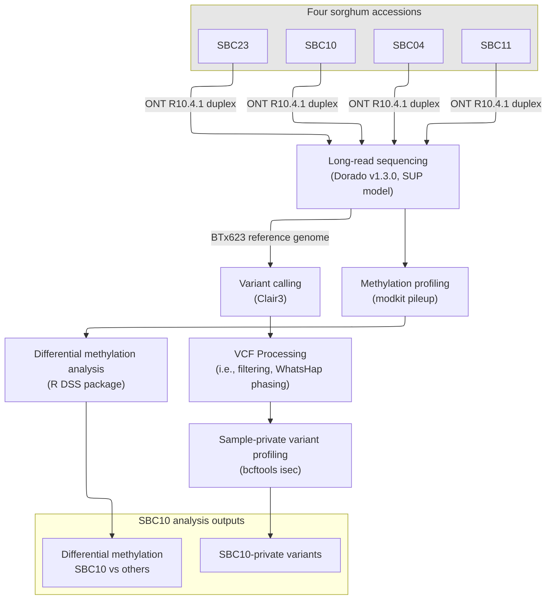
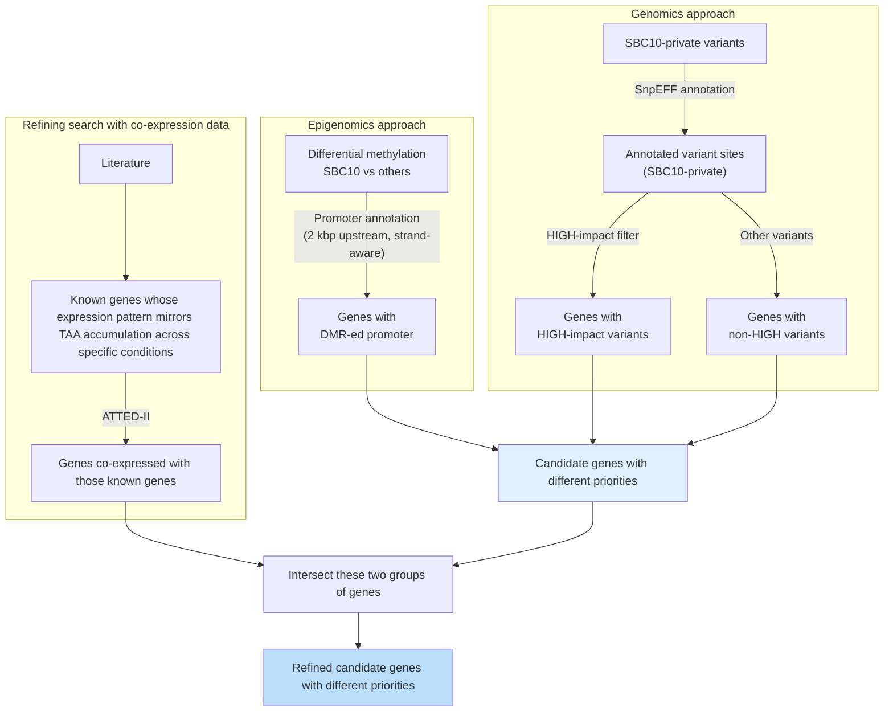

# Identification of TAA-related genes
Functional genomics and epigenomics, both enhanced with gene co-expression analysis to identify key genes in the biosynthesis pathway as well as secretion of trans-aconitic acid (TAA) in sorghum.

## Sample Phenotypes

| Sample | Juice Amount | TAA Accumulation | Callus Formation |
|--------|---------------|---------------|-----------------|
| SBC4 | ++ | High | Mid |
| SBC10 | +++ | Low | Good |
| SBC11 | - | High | Mid |
| SBC23 | ++ | High | Good |

## Study Design
### Data Preparation


### Analysis Overview


## Comparative genomics analysis
Technical steps
1.  `snpeff_prep.sh`: Run the script to prepare the SnpEff database first <br>
    ```shell
    ./docker/run.sh bash analysis/scripts/snpeff_prep.sh
    ```

2.  `private_variants.sh` Find variant sites private to each sample. for each file in the processed VCF files directory (`results/vcf_processing/SBC*.phased.vcf.gz`). <br>
    ```shell
    ./docker/run.sh bash analysis/scripts/private_variants.sh
    ```

3.  `annotate_vcf.sh`: Annotate private variants using SnpEFF. <br>
    ```shell
    ./docker/run.sh analysis/scripts/annotate_vcf.sh SBC10.private analysis/data/vcf/private_variants/SBC10.private.vcf.gz analysis/data/vcf/private_variants
    ```

4.  `annot_single_vcf_to_tsv.py`: Parse single-sampled VCF into TSV to explore in a notebook environment. The other file is designed to parse multi-sample (4 samples merged) VCF. <br>
    ```shell
    ./docker/run.sh python3 analysis/scripts/annot_single_vcf_to_tsv.py -v analysis/data/vcf/private_variants/SBC10.private.annotated.vcf.gz -o analysis/data/tsv
    ```

5.  `03_TAA/TAA.ipynb`: Analyze in notebook.

## Comparative epigenomics analysis
Technical steps
1.  `prepare_taa_dss.py`: Convert whole-genome filtered bedMethyl files to DSS input format. Collapses Watson/Crick CpG strand pairs for 5mC. <br>
    ```shell
    ./docker/run.sh python3 analysis/scripts/prepare_taa_dss.py
    ```
    Output: `analysis/data/taa_DSS/{sample}.5mC.dss.txt`

2.  `run_dss_dmr_taa.R`: Run DSS DML test and DMR calling for SBC10 vs each other accession. <br>
    > Caution:
    Don't execute all 3 scripts simultaneously. <br>
    When the computation where parallelization (when `top` shows all threads loaded with processes) finishes for one pair, then start running the other one.
    ```shell
    ./docker/run.sh Rscript analysis/scripts/run_dss_dmr_taa.R SBC10_vs_SBC4
    ./docker/run.sh Rscript analysis/scripts/run_dss_dmr_taa.R SBC10_vs_SBC11
    ./docker/run.sh Rscript analysis/scripts/run_dss_dmr_taa.R SBC10_vs_SBC23
    ```
    Output: `analysis/data/taa_DMR/{pair}.5mC.DML.tsv`, `{pair}.5mC.DMR.tsv`, `DMR_summary.tsv`

3.  `summarise_dss_dmr_taa.R`: Run script to combine and summarize DMRs across all pairs
    ```shell
    ./docker/run.sh Rscript analysis/scripts/summarise_dss_dmr_taa.R
    ```
    Output: `DMR_summary.tsv`

4.  `annotate_DMR.py`: Annotate DMRs with overlapping genes, using strand-aware 2 kbp upstream promoter regions. <br>
    ```shell
    ./docker/run.sh python3 analysis/scripts/annotate_DMR.py \
        --dmr    analysis/data/taa_DMR/DMR_all_combined.tsv \
        --gff    resources/annot/GCF_000003195.3_Sorghum_bicolor_NCBIv3_genomic.gff \
        --outdir analysis/data/taa_DMR \
        --all-genes
      ```
    Output: `analysis/data/taa_DMR/{pair}.5mC.DMR.annotated.tsv`

5.  `03_TAA/TAA.ipynb`: Integrate DMR gene lists with private variant gene lists to classify candidates by tier.