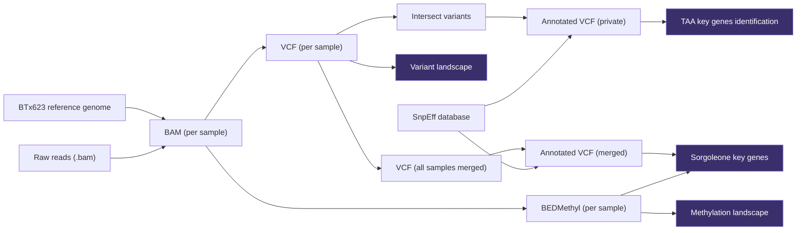

# Analysis Overview

Downstream analyses performed on the processed data. Each section corresponds to a subdirectory or script in `analysis/`.

## Sample Phenotypes

| Sample | TAA Production | TAA Secretion | Callus Formation |
|--------|---------------|---------------|-----------------|
| SBC4 | ++ | High | Mid |
| SBC10 | +++ | Low | Good |
| SBC11 | - | High | Mid |
| SBC23 | ++ | High | Good |

## Data Flow



---

## 00 — Data Quality

**Directory:** `analysis/00_data_quality/`
**Input:** `resources/depth/*.depth`, `resources/depth/*.pkl`

Read depth plots are generated by the `reads_preprocessing.smk` workflow and saved as PNG/SVG/PDF in `resources/depth/`. The `00_data_quality/` directory contains any additional QC summaries and the VCF benchmark figure (`fig0_vcf_benchmark.png`).

To regenerate VCF benchmark figures:
```shell
./docker/run.sh python3 analysis/scripts/vcf_benchmark.py
```

---

## 01 — Variant Landscape

**Script:** `analysis/scripts/variant_landscape.py`
**Input:** SnpEff per-sample stats CSVs in `analysis/data/`
**Output:** `analysis/01_variant_landscape/figures/fig01_*.png` … `fig10_*.png`

Generates summary plots from SnpEff annotation statistics for each sample:

```shell
./docker/run.sh python3 analysis/scripts/variant_landscape.py
```

Figures produced:
| Figure | Content |
|--------|---------|
| fig01 | Variant type distribution |
| fig02 | Effect impact (broken y-axis: 0–10% and 10–100%) |
| fig03 | Genomic region |
| fig04 | Ts/Tv ratio |
| fig05 | Functional class |
| fig06 | Missense/synonymous ratio |
| fig07 | Indel length distribution |
| fig08 | Chromosomal density |
| fig09–10 | Base changes per sample |

---

## 02 — Private Variants

**Script:** `analysis/scripts/private_variants.sh`
**Input:** `results/vcf_processing/*.phased.vcf.gz`

Uses `bcftools isec` to identify variants private to each sample (not shared with others).

```shell
./docker/run.sh bash analysis/scripts/private_variants.sh
```

---

## 03 — VCF Merging

**Script:** `analysis/scripts/merge_vcf.sh`
**Input:** `results/vcf_processing/*.phased.vcf.gz`

Merges per-sample phased VCFs into a single multi-sample VCF for cross-sample comparison.

```shell
./docker/run.sh bash analysis/scripts/merge_vcf.sh
```

---

## 04 — VCF to TSV Conversion

**Script:** `analysis/scripts/annot_vcf_to_tsv.py`
**Input:** annotated merged VCF
**Output:** `analysis/data/tsv/`

Converts the annotated VCF into tabular TSV format for use in downstream notebooks.

```shell
./docker/run.sh python3 analysis/scripts/annot_vcf_to_tsv.py -v <vcf> -o analysis/data/tsv/
```

---

## 04 — Sorgoleone Key Genes

**Directory:** `analysis/04_sorgoleone/`
**Notebook:** `analysis/04_sorgoleone/sorgoleone.ipynb`
**Input:** `analysis/data/tsv/`, `analysis/04_sorgoleone/sorgoleone_key_genes.fna`

Explores variants in genes of the sorgoleone biosynthetic pathway across all four samples. Reference sequences were sourced from the supplementary material of the key publication (`tpj16263-sup-0002-tables1-s3.xlsx`).

```shell
jupyter notebook analysis/04_sorgoleone/sorgoleone.ipynb
```

Notes are in `analysis/04_sorgoleone/sorgoleone.md`.
