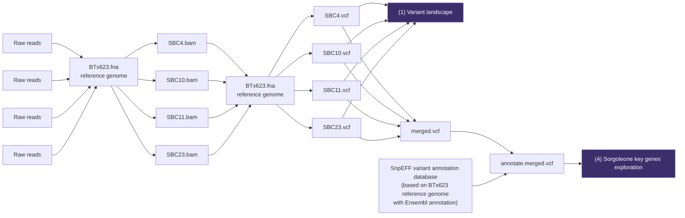

# List of Analyses to Populate the Results & Discussions Section
Samples Phenotype
| Sample | TAA Production | Callus Formation |
|--------|-----------|-----------------------|
| SBC4 | ++ | Mid |
| SBC10 | +++ | Good |
| SBC11 | - | Mid |
| SBC23 | ++ | Good |

## Data flow for each analysis

## Sequencing & data Quality

## Variant landscape

## Epigenomics landscape

## Identification of TAA biosynthetic pathway genes
`analysis/TAA/`

## Exploration of sorgoleone key genes
`analysis/sorgoleone/`

